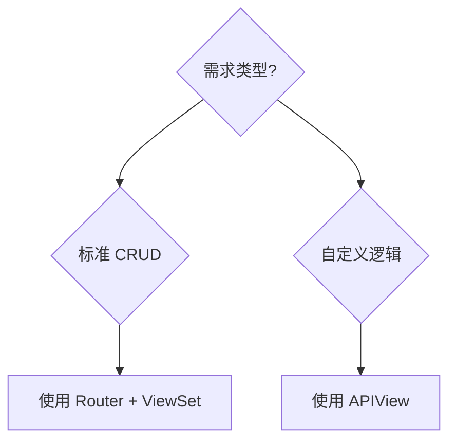

# DRF: Router + ViewSet vs. APIView

#django #drf #api #rest

## 快速选择指南



## Router + ViewSet

**适用场景**：
- ✅ 标准 CRUD 操作（增删改查）
- ✅ 快速生成 RESTful URL（`/resource/`, `/resource/{id}/`）
- ✅ 减少样板代码

```python
# urls.py
router = DefaultRouter()
router.register('audios', SourceAudioViewSet)
# 自动生成: GET/POST /audios/, GET/PUT/DELETE /audios/{id}/
```

## APIView / @api_view

**适用场景**：
- ✅ 非标准 URL 结构（如 `/audios/latest/`）
- ✅ RPC 风格端点（如 `/api/reports/generate/`）
- ✅ 复杂逻辑需要完全控制

```python
@api_view(['POST'])
def generate_report(request):
    # 完全自定义的逻辑
    return Response({"status": "generated"})
```

## 相关链接

- [[11-drf-modelviewset|DRF ModelViewSet]]
- [[18-drf-file-upload|DRF 文件上传]]

*记录于 2025-11-11*
