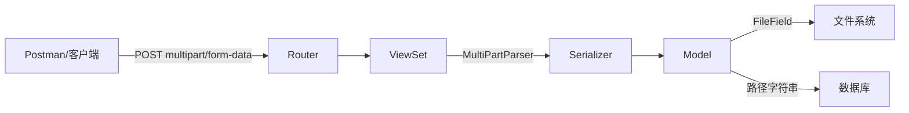

# DRF 文件上传 API 完整指南

#django #drf #file-upload #api

## 核心组件协作



## 四大核心组件

### 1. Model - "数据蓝图"

```python
class SourceAudio(models.Model):
    file = models.FileField(upload_to='audio_slicer/originals/')
    # FileField 只在数据库存储路径，文件存在 MEDIA_ROOT
```

### 2. Serializer - "数据翻译官"

```python
class SourceAudioSerializer(serializers.ModelSerializer):
    class Meta:
        model = SourceAudio
        fields = '__all__'
```

### 3. ViewSet - "厨房大脑"

```python
from rest_framework.parsers import MultiPartParser, FormParser

class SourceAudioViewSet(viewsets.ModelViewSet):
    queryset = SourceAudio.objects.all()
    serializer_class = SourceAudioSerializer
    parser_classes = [MultiPartParser, FormParser]  # 关键！
```

> [!IMPORTANT]
> `parser_classes` 中必须包含 `MultiPartParser`，否则无法解析文件上传请求，会返回 `415 Unsupported Media Type`。

### 4. Router - "地址系统"

```python
router = DefaultRouter()
router.register('audios', SourceAudioViewSet)
# POST /api/v1/audios/ → 创建并上传文件
```

## 完整上传流程

1. **客户端** → `POST /api/v1/audios/` (Content-Type: multipart/form-data)
2. **Router** → 匹配到 `SourceAudioViewSet.create`
3. **MultiPartParser** → 解析文本字段 + 文件数据
4. **Serializer** → 验证数据
5. **FileField** → 文件存到 `MEDIA_ROOT/audio_slicer/originals/`
6. **数据库** → 存储文件相对路径
7. **响应** → `201 Created` + JSON（含文件 URL）

## Parsers 与 Content-Type

| Parser | Content-Type | 用途 |
|--------|--------------|------|
| `JSONParser` | application/json | 普通 JSON 请求 |
| `MultiPartParser` | multipart/form-data | **文件上传** |
| `FormParser` | application/x-www-form-urlencoded | 表单数据 |

## 相关链接

- [[11-drf-modelviewset|DRF ModelViewSet]]
- [[13-file-uploads|文件上传基础]]
- [[14-django-signals|Django Signals]]

*记录于 2025-11-11*
