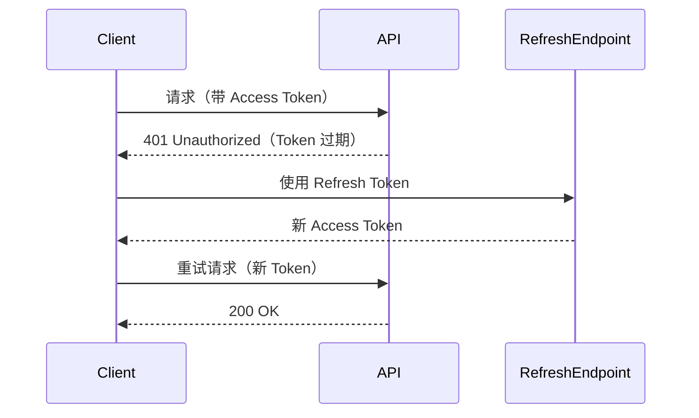

# JWT Token 刷新机制

#django #jwt #authentication

## Access Token vs Refresh Token

| Token | 有效期 | 用途 |
|-------|--------|------|
| Access Token | 短（如 5 分钟） | 访问 API |
| Refresh Token | 长（如 7 天） | 获取新 Access Token |

## Django SimpleJWT 配置

```python
# settings.py
REST_AUTH = {
    'USE_JWT': True,
    'JWT_AUTH_COOKIE': 'my-auth-cookie',
    'JWT_AUTH_REFRESH_COOKIE': 'my-refresh-cookie',
}
```

```python
# urls.py
path('api/token/refresh/', get_refresh_view().as_view(), name='token_refresh'),
```

## 前端自动刷新流程



## Axios 拦截器实现

```typescript
// axios.ts
axios.interceptors.response.use(
    response => response,
    async error => {
        if (error.response.status === 401) {
            await axios.post('/api/token/refresh/')
            return axios(error.config)  // 重试原请求
        }
        return Promise.reject(error)
    }
)
```

## Axios 配置

```typescript
const api = axios.create({
    baseURL: '/api',
    withCredentials: true  // 使用 Cookie 中的 Token
})
```

> [!IMPORTANT]
> `withCredentials: true` 是使用 httpOnly Cookie 存储 Token 的必要配置。
