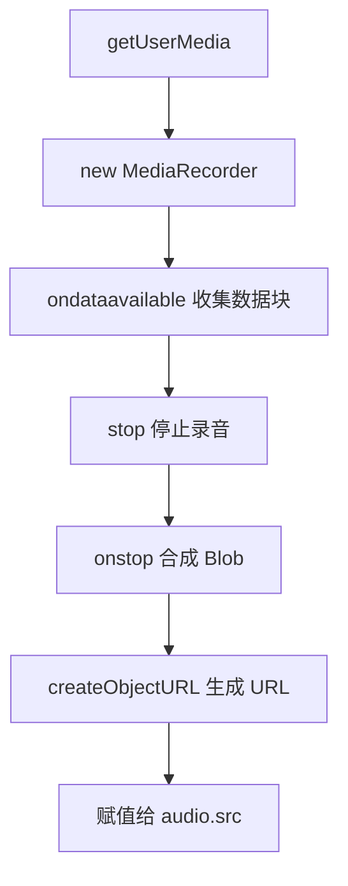

# 浏览器原生录音 (MediaRecorder) 核心流程

#frontend #audio #web-api #mediarecorder

## 概述

这是在浏览器前端实现录音功能，而无需任何插件的标准模式。

## 核心流程



### 1. 请求权限

使用 `navigator.mediaDevices.getUserMedia({ audio: true })` 异步请求麦克风权限，并获取一个 `MediaStream` 对象。

### 2. 创建实例

```javascript
const recorder = new MediaRecorder(stream);
```

用上一步获取的流来创建一个 `MediaRecorder` 实例。

### 3. 收集数据

监听 `recorder.ondataavailable` 事件。该事件会在录音过程中（或在停止时）触发，其 `event.data` 是一个包含音频数据的 `Blob` 数据块。

```javascript
const chunks = [];
recorder.ondataavailable = (event) => {
    chunks.push(event.data);
};
```

### 4. 停止与合成

调用 `recorder.stop()` 停止录音。这会自动触发：
1. 最后一次 `ondataavailable` 事件
2. 随后触发 `recorder.onstop` 事件

### 5. 生成 URL

在 `onstop` 事件的回调中：

```javascript
recorder.onstop = () => {
    const blob = new Blob(chunks, { type: 'audio/webm' });
    const url = URL.createObjectURL(blob);
    audioElement.src = url;
};
```

## 关键注意事项

### 内存管理

> [!WARNING]
> `createObjectURL` 生成的 URL 会占用浏览器内存。必须在它不再需要时手动释放：
> 
> ```javascript
> URL.revokeObjectURL(oldUrl);
> ```
> 
> 典型时机：组件卸载或创建新录音时。

### 关闭麦克风指示

调用 `recorder.stop()` 后，应彻底关闭媒体流：

```javascript
stream.getTracks().forEach(track => track.stop());
```

这会：
- 终止对麦克风的占用
- 关闭浏览器上显示的"正在录音"的小红点或图标

> [!TIP]
> 这是良好的用户体验实践，用户会明确知道录音已经结束。

---

## 相关链接

- [[wavesurfer-mp3-decode-issue|wavesurfer.js MP3 解码问题]]

*记录于 2025-11-07*
