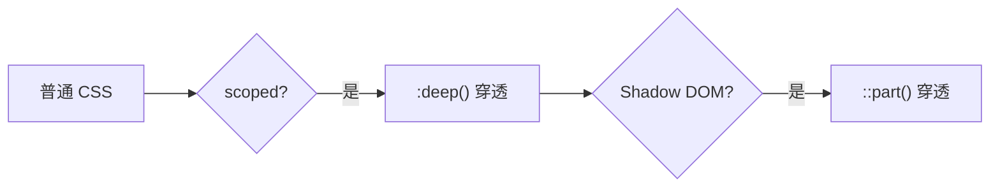

# Vue scoped 样式与 Shadow DOM 穿透

#vue #css #shadow-dom

## 三层穿透机制



## 1. scoped CSS 原理

```vue
<style scoped>
p { color: red; }
</style>
```

编译后：`p[data-v-xyz123] { color: red; }`

**限制**：无法影响子组件内部元素。

## 2. :deep() 穿透子组件

```css
.parent :deep(.child-class) {
  color: blue;
}
```

编译后：`.parent[data-v-xyz123] .child-class`

> [!NOTE]
> `:deep()` 只能穿透 Vue scoped，不能穿透 Shadow DOM。

## 3. ::part() 穿透 Shadow DOM

当第三方库使用 Shadow DOM（如 WaveSurfer.js）：

```html
<div class="scroll" part="scroll">...</div>
```

穿透方式：

```css
.wavesurfer-host :deep(::part(scroll)) {
  scrollbar-width: none;
}
```

## 调试步骤


---

## Vue 事件修饰符与自定义事件

### 原生事件修饰符

```vue
<!-- ✅ 原生 DOM 事件：修饰符有效 -->
<div @click.stop="handleClick">
<input @keydown.enter.prevent="handleSave">
```

### 自定义事件的限制

```vue
<!-- ❌ 自定义事件：.stop/.prevent 无效 -->
<BaseWaveSurfer @region-clicked.stop="handleRegionClicked" />
```

**原因**：`@region-clicked` 是组件 emit 的自定义事件，参数只是普通数据，不是 Vue 可拦截的事件对象。

**解决方案**：在回调中手动调用：

```typescript
const handleRegionClicked = (region: Region, e: MouseEvent) => {
    e.stopPropagation()  // 必须手动调用
}
```

> [!IMPORTANT]
> 事件修饰符只适用于**原生 DOM 事件**，自定义事件必须在回调函数中手动处理。

1. 元素在当前组件？→ 直接写 CSS
2. 在子组件内？→ 用 `:deep()`
3. 在 Shadow DOM 内？→ 用 `::part()`
