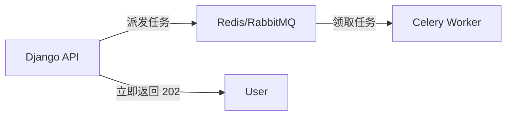

# subprocess 与 Celery 异步任务

#python #subprocess #celery #async

## subprocess 同步执行

```python
import subprocess

result = subprocess.run(
    ['ffmpeg', '-i', 'input.mp3', '-c', 'copy', 'output.mp3'],
    check=True,           # 命令失败时抛出异常
    capture_output=True   # 捕获 stdout/stderr
)
```

**特点**：
- 同步阻塞：Python 等待命令执行完毕
- 适用于几秒内完成的快速任务

> [!WARNING]
> 耗时任务会阻塞整个 Web 请求，导致用户等待。

---

## Celery 异步任务队列

**问题**：Whisper 转录需要 30 秒，不能让 HTTP 连接等这么久。

**解决**：任务外包系统



### 工作流程

1. **定义任务**：把耗时操作定义为 Celery 任务
2. **派发任务**：API 只发消息到队列，几乎瞬间完成
3. **立即响应**：返回 `202 Accepted`，告诉用户后台处理中
4. **后台执行**：Worker 进程从队列领取任务执行

### 示例

```python
from celery import shared_task

@shared_task
def transcribe_audio(audio_path):
    # 耗时的 Whisper 转录
    return result
```

```python
# views.py
def upload_audio(request):
    transcribe_audio.delay(audio_path)  # 异步派发
    return Response({"status": "processing"}, status=202)
```
