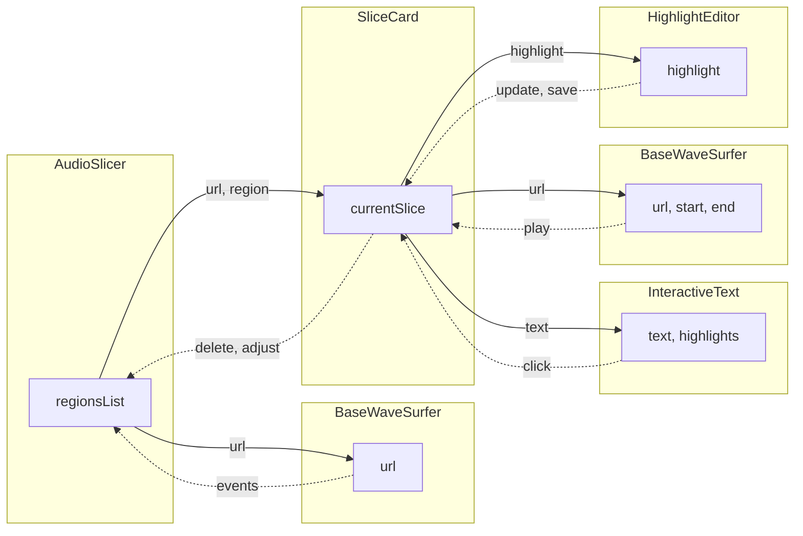
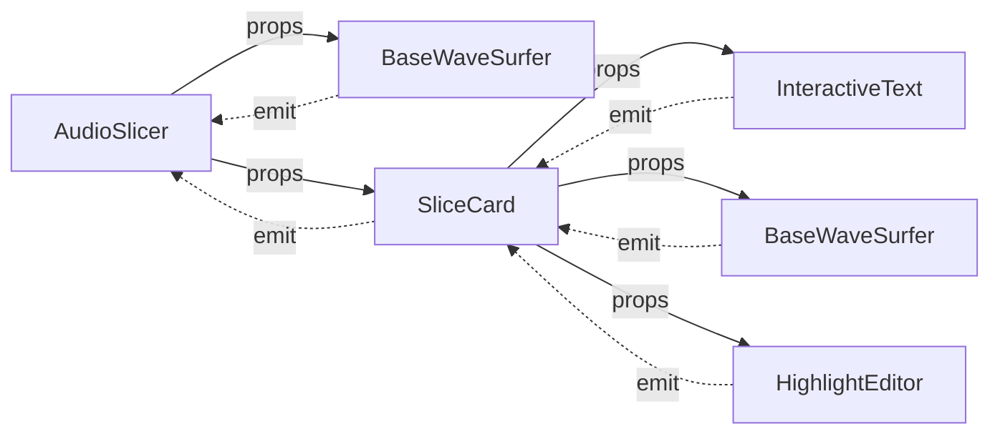

```mermaid
flowchart LR
    subgraph Parent["AudioSlicer"]
        AS[regionsList]
    end

    subgraph Child1["BaseWaveSurfer"]
        BWS1[url]
    end

    subgraph Child2["SliceCard"]
        SC[currentSlice]
    end

    subgraph GrandChild1["InteractiveText"]
        ITH[text, highlights]
    end

    subgraph GrandChild2["BaseWaveSurfer"]
        BWS2[url, start, end]
    end

    subgraph GrandChild3["HighlightEditor"]
        HE[highlight]
    end

    AS -->|url| BWS1
    AS -->|url, region| SC
    SC -->|text| ITH
    SC -->|url| BWS2
    SC -->|highlight| HE

    BWS1 -.->|events| AS
    SC -.->|delete, adjust| AS
    ITH -.->|click| SC
    BWS2 -.->|play| SC
    HE -.->|update, save| SC
```

BaseWaveSurfer Events:

- `region-created`
- `region-updated`
- `region-removed`
- `region-in`
- `region-out`
- `region-clicked`
- `play`
- `pause`
- `ready`

```mermaid
flowchart LR
    AS[AudioSlicer] -->|props| BWS1[BaseWaveSurfer]
    AS -->|props| SC[SliceCard]
    SC -->|props| ITH[InteractiveText]
    SC -->|props| BWS2[BaseWaveSurfer]
    SC -->|props| HE[HighlightEditor]
    
    BWS1 -.->|emit| AS
    SC -.->|emit| AS
    ITH -.->|emit| SC
    BWS2 -.->|emit| SC
    HE -.->|emit| SC
```
