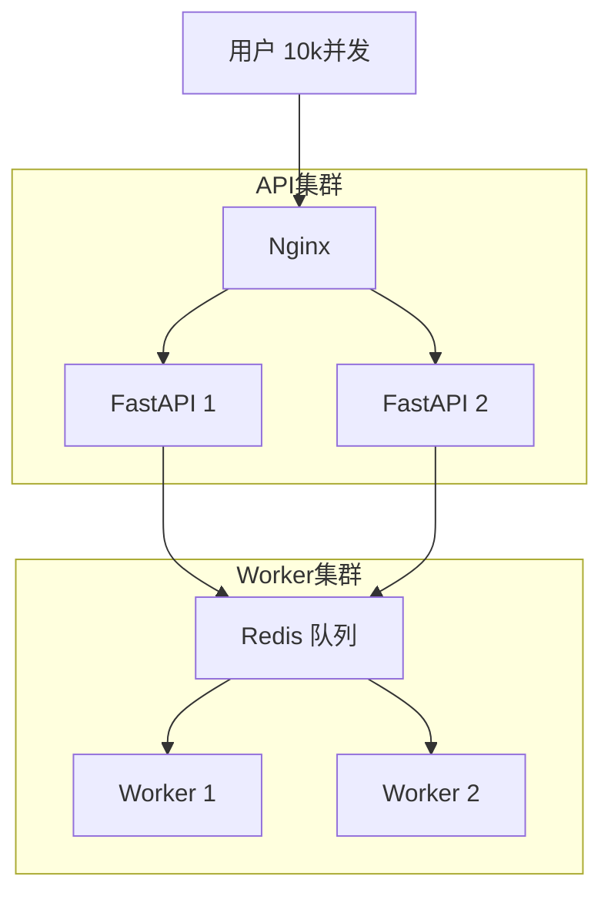

# 高并发处理：三层架构

#interview #python #concurrency #system-design

经典系统设计问题的标准答案：三个维度的"组合拳"。

## 1. 接入层：异步非阻塞

**关键词**：`FastAPI`, `uvicorn`, `epoll`, `IO密集型`

**问题**：10,000 用户同时请求，都在等待 IO。

**解决**：
- 传统框架：一线程一请求，线程池耗尽卡死
- **FastAPI**：Event Loop，一线程挂起成千上万等待请求

> [!WARNING]
> 只能解决 IO 等待，解决不了 CPU 计算（如模型推理）。

---

## 2. 业务层：任务队列

**关键词**：`Celery`, `Huey`, `Redis`, `削峰填谷`

**问题**：
- 耗时任务（Whisper 30秒转录）
- 流量洪峰（1000 请求，4 张显卡）

**解决**：
- **生产者 (API)**：收单扔队列，1ms 返回
- **消费者 (Worker)**：按能力慢慢取任务处理

---

## 3. 基础设施层：水平扩展

**关键词**：`Docker`, `K8s`, `Nginx`

**问题**：单机 CPU/内存/显存 跑满。

**解决**：加机器！10 个 Worker 消费同一个 Redis 队列。

---

## 架构图

## 面试话术

> "处理高并发需要分层治理：
> 1. **接入层**用 FastAPI (Async) 处理海量连接
> 2. **业务层**用 Huey/Celery + Redis 剥离耗时任务
> 3. **架构层**用 Docker/K8s 水平扩展"
