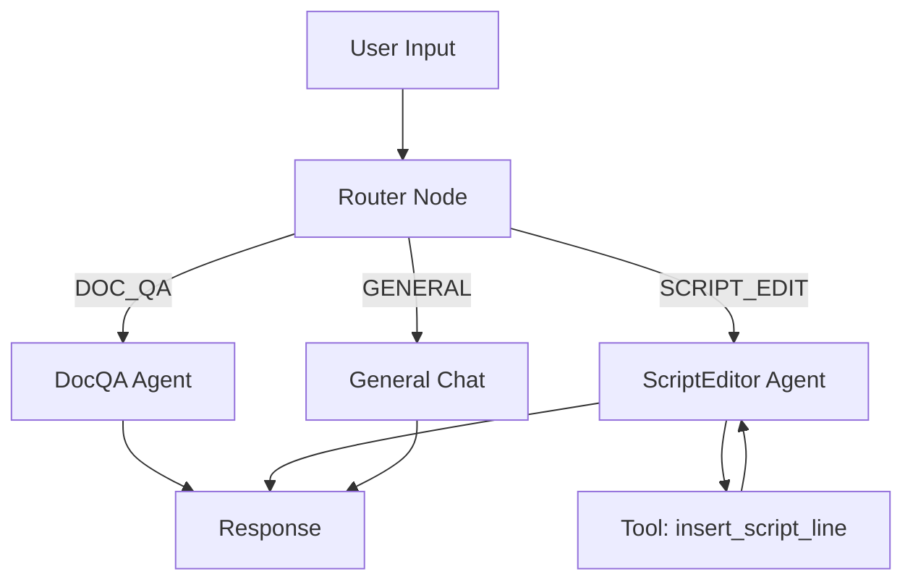

## `_get_llm`

 * [x] 这样会不会消耗时间？
	 不会，瞬时完成。
### 目的

根据 `settings.py`中的配置灵活地选择使用的 LLM 模型。并且可以根据局部的配置更新相关配置。但是目前 `settings.py` 配置比较简单，provider 只有提供了 Deepseek，可以后面慢慢更新。 

知识点：
- [python]`dict1.update()` | `dict1 | dict2` | `dict1 |= dict2`
- [python]  `list1.reverse()`，不影响原列表，返回一个迭代器，而不是直接返回一个新的列表。

## Router Mode

### 知识点
#### 字符串拼接
多行字符串（`"""`）中，行尾的反斜杠 `\` 是为了防止换行符被包含到最终的字符串里。
- 一般情况：编写多行字符串时，在代码中敲下的每一个回车都会被原封不动保存为字符串里的换行符
- 加上 `\`：告诉程序“忽略紧跟在后面的这个换行符。

### `ROUTER_SYSTEM_PROMPT`
- 文档、App 使用相关、且不是有关语言学习的内容 → `DOC_QA`
- 如果用户想要操作台词 → `SCRIPT_EDIT`
- 英语语言学习问题、打招呼、闲聊等 → `GENERAL`

### `router_node`逻辑梳理
- **输入**：`AgentState`
- **输出**：字典（更新 State）

1. 对 `AgentState` 的 `messages` 进行反序排列（`reversed`），找到最新的一条 Human Message（`isinstance` 结合 `break`）。
2. 将上一步中提取到的 Human Message 注入到 Router Prompt 中。
3. 触发 LLM Chain，得到返回结果（Router Agent 判断到的下一个节点名称）。并将返回的字符串进行格式化（去除首尾Whitespace、全部大写）；并且谨慎起见，这个节点 temperature 刻意设置为 0，杜绝发散。
4. 根据下一个节点名称，更新`next` 键值到 `AgentState`。注意：Router 节点没有和普通的节点一样 `return {"messages": [response]}`，因为分类结果不应该作为”这轮聊天对话追加到消息记录里！Router 做的操作是悄悄往 `State` 上写下一个标签：`{"next": "doc_qa"}`，然后将执行权给下一张图里的条件边：`route_decision`，它会看到 `script_editor` 节点。 

### `route_decision`逻辑梳理
- **输入**：`AgentState`
- 输出：字符串
从 `AgentState` 读取下一个节点名。

## `DOC_QA`节点

### DOC_QA_SYSTEM_PROMPT

- 使用用户提问时使用的语言
- 上下文无关时，诚实坦白
- 从文档中进行参考
- 对于“怎么做”的问题，提供详细步骤指引

### `doc_qa_node`
1. 将 `doc_qa` 作为 `feature`，创建 `llm` 实例。目前没有为 `doc_qa` 设置专门的 LLM 配置，实质使用的是 `default`配置，也就是 Deepseek，因为 Deepseek 性价比高。
2. 仍然提取出最近一条 HumanMessage，并且将它作为 `query`，来从 RAG 中找到5条近似的结果。
3. 将检索到的文档片段格式化为 XML 风格的字符串，包括标题、内容和来源信息
4. 将检索到的文档片段格式化为列表，包含标题、路径和主题类型
5. 将第3步中格式化后的文档片段结果注入到 `DOC_QA_SYSTEM_PROMPT`中，并且提供所有的历史记录（`AgentState` 的 `messages`列表），触发并得到 LLM 响应结果。
6. 最终将上一步的响应结果、`context`（文档片段检索结果字符串）和 `sources` 更新到 `AgentState`。

几个值得注意的点：
- 第5步中，是将文档片段注入到 `SystemMessage`的，而不是假装成人类追加的信息发过去。由于 `SystemMessage` （带有一切权限规范和资料答案）像太上皇一样压在整个时间线的最上方，大模型的注意力永远都会对它保持最高的权重和敬畏。
### 知识点：`vector_store`

#### 创建通道

向量数据库不是存在于内存中的 Python 字典，而是一个实实在在保存在某个电脑磁盘上的数据堆（在我们的项目里，是一个保存在本地的 SQLite 二进制文件）创建 `DITAVectorStore`实例时，并不是在创建数据库，而是创建一条通向向量知识库的通道。

#### 读写分离

**写**：灌输一般是离线灌输。一般是通过某个脚本、Django Management Command 或者手动触发一个一次性任务来完成的。动作流程包括：
1. 读取本地 `.dita` 或者 `markdown` 文档
2. 切割成长端合适的代码块
3. 调用 `DITAVectorStore().add_chunks()`
4. 调用 Embedding API，将文本变成一长串数字浮点数，然后连同文本一起存入 `chroma_db` 硬盘文件中进行保存。

**读**：在线推理，用户在前端发来一条消息的一瞬间，会读取 RAG 并进行推理：
1. `graph.py`里的 `doc_qa`节点被激活。
2. 执行 `vectore_store=DITAVectorStore()`，挂上连接通道。
3. 执行`vector_store.search(query=last_msg)：
	1. 先调用 Embedding API 将用户的提问翻译成一次浮点数数组。（这里使用的是第三方提供的 `embed_query` 方法）
	2. 在那个固定的库里执行相似度数学计算，找出前5个最相似的知识块。
4. 把这5个知识块交给大模型去组装答案。

## ScriptEditor Node

这是一个工具节点，也是真正体现了大语言模型能力上限和所谓“智能体”特性的地方，因为它是图里唯一一个“长了手”并且会自己思考的节点，它也是整个架构最有魅力的一部分。

### `SCRIPT_EDITOR_SYSTEM_PROMPT`

告诉 LLM 工作是台词编辑者。有一些工具可以使用（参见）。
#### 操作要义：
- **先读后写**： 在插入和编辑前，必须调用 `get_surrounding_lines`来了解上下文语义，而不是用猜测的方式
- **部分文本编辑**：1.通过 `get_surrounding_lines`读取上下文；2. 只对目标词语/词组进行替换；3. 传入修改后完整的句子作为 `text` 参数的值；4. 不能仅传递修改的词语！（重要：并且在这之后给出了场景范例。）
- **同步中文**：文本更新后必须同步中文 `text_zh`
- **说话人**：说话人推断和改正
- **语言和语气**：使用提问语言进行回答；执行任务后，总结做了什么。
- **拆分长台词**：如何推断关联到哪个chunk / 翻译同步的问题 

### 挂钩工具表


```Python
SCRIPT_TOOLS = [get_surrounding_lines, insert_script_line, edit_script_line, split_script_lin] # 列出所有的 tools

llm = _get_llm(feature="script_editor", temperature=0) # 基础 LLM

llm_with_tools = llm.bind_tools(SCRIPT_TOOLS) # 挂钩工具表到 LLM


```

#### 工具罗列
- `get_surrounding_lines` - 抓取指定台词前后上下文，需要插入或编辑台词时，必须先调用这个工具
- `insert_script_line` - 在指定台词前/后插入台词
- `edit_script_line` - 编辑指定台词
- `split_script_line` - 拆分长台词。

#### “起底” `bind_tools`：这个方法究竟做了什么

当你执行 `llm.bind_tools(SCRIPT_TOOLS)` 时，底层框架（LangChain）偷偷把你的那几个 python 函数（比如 `edit_script_line`）的名字、参数要求、文档注释（docstring），翻译成了一长串严格的 JSON Schema，并在请求发起时悄悄附加在了你的 SystemMessage 里面，发给了大模型。

大模型收到后一看：“哦！原来你可以给我提供 `edit_script_line(line_id: int, text: str)` 这么一个函数供我调用”。

#### 工具调用进入 ReAct 循环

ReAct 表示 Reasoning and Acting，也就是先推理再行动地一种“循环思考”的能力。当收到一条这样的用户的请求：”把第50行的主语改对，你看一下上下文。“，ReAct 大概的步骤如下。
1. **模型拿到请求**：“我要改第50行，但我需要看上下文，刚好我有 `get_surrounding_lines`这个武器。“
2. 模型暂停生成文字，而是向你发出信号：”系统，请你立马去跑一下 `get_surrounding_lines(50)`，然后将结果给我。
3. 系统（由 LangGraph 的 Conditional Edge `should_continue_tools`触发，并跳转到 `tools` Node：帮它运行那个函数，带着查出来的相邻的句子回来。
4. 模型拿到上文：“哦，原来第49行是 Bob 在说话，所以第50行主语肯定是 I，我该出动 `edit_script_line` 这个工具了！
5. 模型再次暂停，发出信号：系统，去跑 `edit_script_line(50, 'I....'`)“。
6. 系统跑完：“改好了！”
7. 模型最终向用户输出：“我已经帮您把第50行的主语参考 Bob 的语境修改为 I 啦！”。

#### `should_continue_tools`的重要性

它只要看到大模型返回的 `last_message.tool_calls`里还有东西，它就会一直把流程丢给 `tools` Node 去执行动作，然后再抛回给 `script_editor` 让它继续思考，直至大模型觉得自己已经功德圆满，不再调用工具为止。

下面的代码就反应了其中的逻辑：检查最后一条 Message 是否有 `tool_calls` 属性，且作为值的列表不是一个空列表，那么就会导向 `tools` 节点，否则就前往 `END`。
```python
def should_continue_tools(state: AgentState) -> str:
    """Check if the last message has tool calls; if so, route to tool node."""
    last_message = state["messages"][-1]
    if hasattr(last_message, "tool_calls") and last_message.tool_calls:
        return "tools"
    return END
```

## `GENERAL CHAT NODE`

### `GENERAL_SYSTEM_PROMPT`

强调了如果是发音解释，需要遵循美式口语中的规律。

### `general_node`
1. 创建 LLM 实例，这里会用 0.7 作为 temperature，从而保持一定的创造性和发散性。
2. 将 `GENERAL_SYSTEM_PROMPT`和历史消息记录提供给 LLM，得到响应，更新 `AgentState`。

## 创建多智能体 `graph`

1. 定义 State 数据结构：
	```python
	from typing import Annotated, Literal
	from typing_extensions import TypedDict
	from langgraph.graph.message import add_messages
	class AgentState(TypedDict):
	    """
	    Shared state for the multi-agent graph.
	    Fields:
	        messages: Conversation history (auto-merged via add_messages reducer)
	        next: Routing decision from the router node
	        context: Retrieved RAG context (for DocQA)
	        sources: Source documents from vector search
	    """
	    messages: Annotated[list, add_messages]
	    next: Literal["doc_qa", "script_editor", "general"]
	    context: str
	    sources: list[dict]
	```
2. 创建一张空的 StateGraph，将定义好的 State 的数据结构传入进去。
	```python
	from langgraph.graph import StateGraph, END
	graph = StateGraph(AgentState)
	```
3. 通过 `graph.add_node("node_name", node_logic)`注册节点。比如：
	```python
	graph.add_node("router", router_node)
	graph.add_node("doc_qa", doc_qa_node)
	graph.add_node("script_editor", script_editor_node)
	graph.add_node("general", general_node)
	```
	之前在定义 `script_editor_node`时，我们有做过 `bind_tools`的操作。打个比方来说，llm 是我们招募的“军师“，而 `SCRIPT_TOOLS` 则是递给”军师“的兵器谱。军师知道了4个函数的名字、参数说明（JSON Schema 格式）。也就是说知道有哪些”兵器“可以用。军师只有嘴，会调度，却没有手，对于兵器去执行和发挥作用，需要我们通过 `ToolNode`来为系统配备打手。
	配备好打手后，当“军师”举起牌子（LLM 回复里带有 `tool_calls` 标志）时，`should_continue_tools`路由器就会说：“传令下去，XXX（执行工具）出列接任务！”。此时，流程来到了 `tools`节点。XXX完成任务后，ToolNode 会将执行结果打包成一条特殊的 `ToolMessage`，顺着 Edge 又扔回给 `script_editor`军师那，让军师定夺下一步应该做什么。
	```Python
	graph.add_node("tools", ToolNode(SCRIPT_TOOLS))
	```
4. 指定这个 MultiAgent 的起始节点，也就是路由器本身。
	```Python
	graph.set_entry_point("router")
	```
5. 路由器会根据最近一条 `HumanMessage`，来更新下一个节点（`next` 属性）名称到 `AgentState`中。因此，对于 `router`到下一个节点的 Flow Control，需要依赖 `Conditional Edge`来完成。
	```Python
	graph.add_conditional_edges(
		"router",
		route_decision,
		# 如果未显式传输映射表，底层引擎也可以自动识别，只要返回的字符串与下一个目标节点的名字是完全一致的。
		{
			"doc_qa": "doc_qa",
			"script_editor": "script_editor",
			"general": "general",
		}
	)
	```
6. `doc_qa` 和 `general` 都是相对简单的节点。执行完毕后，就表示任务结束，因此只要连接到 `END` 即可。
	```Python
	graph.add_edge("doc_qa", END)
	graph.add_edge("general", END)
	```
7. 而 `script_editor` 作为一个“有兵器谱的军师”，需要：
	A. 军师查找兵器谱，喊出需要出列的工具并标记到 `tool_calls` 中。
	B. 工具执行并将结果包装到 `ToolMessage` 返回给军师，让军师判断下一步行动。
	C. 军师如果觉得还需要调用兵器，就继续 A → B；如果觉得已经完成任务后，就不添加 `tool_calls`，这样就表示任务完成。这个逻辑判断由 `should_continue_tools` 方法完成。
	```Python
	graph.add_condional_edge(
		"script_editor",
		should_continue_tools,
		{
			"tools": "tools",
			END: END
		}
	)
	```
	对于 B 步骤，同样需要显式添加 EDGE：
	```Python
	graph.add_edge("tools", "script_editor")
	```


## Todos
* [ ] [2026-02-25] tools 添加删除功能 （可以用 Chunk 51 的第一句练手）


