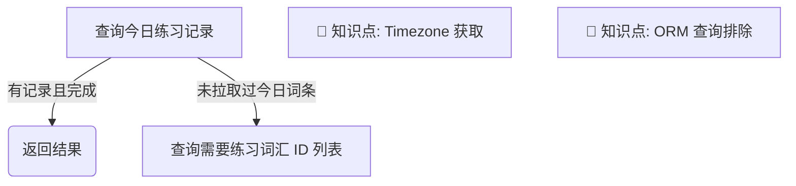

```mermaid
graph TD
    A[查询今日练习记录] -->|有记录且完成| B(返回结果)
    A -->|未拉取过今日词条| C[查询需要练习词汇 ID 列表]
    
    %% 旁注知识点作为独立节点或子图
    K_Timezone[📖 知识点: Timezone 获取]
    K_ORM[📖 知识点: ORM 查询排除]

    %% 绑定点击事件 (随点随跳)
    click K_Timezone "https://你的技术笔记链接/timezone" "点击查看 Timezone 详解"
    click K_ORM "https://你的技术笔记链接/orm-exclude" "点击查看 Django ORM 详解"
```
