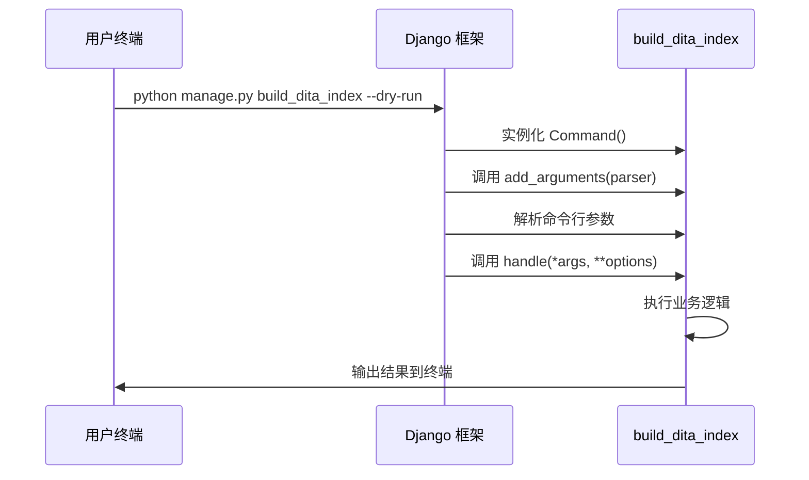

## 为什么使用 Management Command？

|场景|适合方式|
|---|---|
|定时任务（如每日构建索引）|✅ Management Command + cron/celery|
|数据库迁移后的初始化|✅ Management Command|
|一次性脚本|✅ Management Command|
|API 请求触发的操作|❌ 使用 View 或 Service|

这种模式让你的脚本可以：

1. 自动加载 Django settings 和环境
2. 访问 ORM 和所有 Django 组件
3. 统一的参数解析和帮助文档
4. 方便在生产环境中通过 SSH 或调度器运行
## 创建自定义命令并通过 `python manage.py`运行

1. Django 提供 `BaseCommand` 这个基类，允许你创建自定义命令，然后通过 `python manage.py <command_name>`来执行。
2. 需要注意文件位置。
	```
	doc_assistant/
	├── management/
	│   ├── __init__.py      # 必须有，即使是空文件
	│   └── commands/
	│       ├── __init__.py  # 必须有
	│       └── build_dita_index.py   # 👈 你的命令文件
	```
3. 将 APP 注册到 Django 项目中的 `INSTALLED_APPS` 后，Django 会自动扫描该 APP 下的 `management/commands/`目录。文件名就是命令名。所以个人文件对应的命令就是：
	```Shell
	python manage.py build_dita_index
	```

### 类定义

类继承 `BaseCommand` 基类，并且必须命名为 `Command`。

```Python
from django.core.management.base import BaseCommand

class Command(BaseCommand):
	# ...
```

## 关于 `--help`

#### 根级帮助文字
```python
from django.core.management.base import BaseCommand

class Command(BaseCommand):
	help = "Build or rebuild the DITA documentation vector index"
	# ...
```

显示如下图红色高亮处。

### 命令行参数中的帮助文字

```python
from django.core.management.base import BaseCommand

class Command(BaseCommand):
	def add_arguments(self, parser):
        parser.add_argument(
            '--clear',
            action='store_true',
            help='Clear existing index before building',
        )
    # ...
```

显示如下图绿色高亮处。

帮助文字会在运行 `python manage.py build_dita_index --help`时显示。

![[custom-command__help-text.png]]

## `add_arguments`：定义命令行参数

### `parser`

`parser`就 Python 标准库的 `argparse.ArgumentParser`，因此可以使用所有的 `argparse`功能。

```python
from django.core.management.base import BaseCommand

class Command(BaseCommand):
	help = "..."
	
	def add_arguments(self, parser):
		parser.add_argument(
			'--clear', # ←--- 命令行参数名称
			action='store_true', # ←--- 布尔开关，出现即为 True，不出现为 False
			help='...',
		)
		parser.add_argument(
			'--dita-path',
			type=str, # ←--- 
			default=None, # ←--- 可选参数，有默认值
			help='Custom path to DITA files',
		)
	
```

`parser` 是 Django 框架在调用 `add_arguments()`时作为参数传入的。底层机制类似这样：

```Python
from argparse import ArgumentParser

parser = ArgumentParser() # ←--- 标准库的 ArgumentParser

# 添加 Django 自带的通用参数
parser.add_argument('--verbosity', ...)
# ...

# 然后调用你的方法，把 parser 传进去
command = Command()
command.add_argument(parser) # ←--- 这里传入

# 解析命令行
options = parser.parse_args()

# 执行你的逻辑
command.handle(**options)

```

### 开关型参数：`action='store_true'`

这是一个布尔开关，参数本身不需要跟值。

```bash
# 使用时
python manage.py build_dita_index --clear

# 不使用时
python manage.py build_dita_index
```

对应的值：

| 命令                                          | `options['clear']` 的值 |
| ------------------------------------------- | --------------------- |
| `python manage.py build_dita_index --clear` | `True`                |
| `python manage.py build_dita_index`         | `False`               |

**注意：** `--clear` 后面不跟任何值，它的出现本身就代表 "开启"。
类比：就像电灯开关 💡
- 写了`--clear` = 按下开关 → 灯亮（True）
- 没写 `--clear` = 没按 → 灯灭（False）
#### 使用

```Shell
python manage.py build_dita_index --clear
```

### 核心逻辑

`handle()` 定义核心逻辑

* <b style="color: cyan">options</b>：`options`是一个字典，包含所有命令行数
* <b style="color: cyan">注意</b>：命令行参数中的 `-` 会被转换成 `_`，所以 `--dita-path` 变成 `options['dita_path]`。
* <b style="color: cyan">输出方法</b>：使用 `self.stdount` 和 `self.stderr`，而不是 `print`，便于测试时捕获输出。

```Python
# from ... import BaseCommand

# class Command(BaseCommand):
	# def add_arguments(self, parser):
		# ...
	# 
	
	def handle(self, *args, **options):
		# ...
		if options['dita_path']: # ←--- 对应 --dita_path 
```




